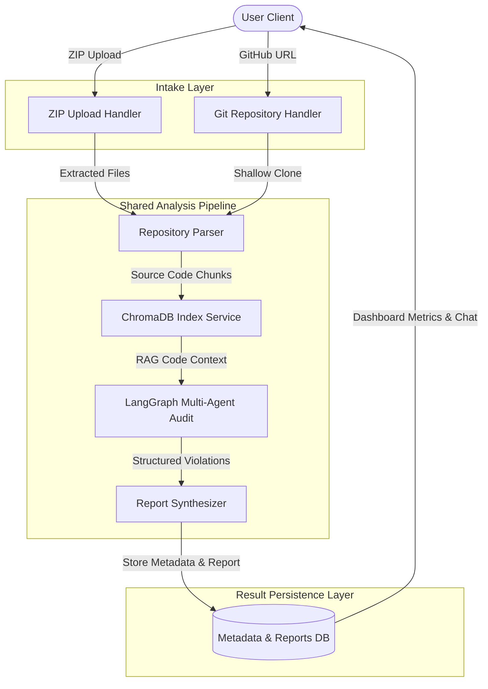

# AI-Powered Software Engineering Assistant - Backend

This folder contains the complete, asynchronous FastAPI backend for the **AI-Powered Software Engineering Assistant**.

## Technology Stack
- **FastAPI**: Asynchronous web framework.
- **SQLAlchemy (Async)**: Modern async ORM for PostgreSQL and SQLite.
- **SQLite / PostgreSQL**: Stores repository metadata, analysis state, and reports.
- **ChromaDB**: Local vector database for codebase semantic indexing and RAG queries.
- **LangGraph**: Multi-node agent orchestrator for workflow-driven codebase analysis.
- **Gemini API (`gemini-2.5-flash`)**: Code analysis engine.
- **GitPython**: Library for programmatically cloning Git repositories.

---

## System Architecture



---

## Getting Started

### 1. Requirements
- Docker & Docker Compose OR Python 3.11+ with Git installed on the host.
- A Google Gemini API Key.

### 2. Environment Setup
Create a `.env` file in this directory based on the `.env.example` template:
```bash
cp .env.example .env
```
Open `.env` and fill in your Gemini API Key:
```env
GEMINI_API_KEY=your-actual-gemini-key
```

### 3. Spin up the containers
Build and start the application in the background:
```bash
docker-compose up --build -d
```
FastAPI database migrations will run automatically on startup via SQLAlchemy context execution.

---

## API Documentation

Once the services are running, the interactive Swagger documentation will be available at:
- **Swagger UI**: [http://localhost:8000/docs](http://localhost:8000/docs)
- **ReDoc**: [http://localhost:8000/redoc](http://localhost:8000/redoc)

### Core Endpoints

#### 1. Analyze Git Repository
- **Endpoint**: `POST /api/v1/repositories/analyze-github`
- **Content-Type**: `application/json`
- **Payload**:
  ```json
  {
    "repo_url": "https://github.com/user/repository"
  }
  ```
- **Response**: Returns the created project object with status `pending`.

#### 2. Upload Repository ZIP
- **Endpoint**: `POST /api/v1/projects/upload`
- **Content-Type**: `multipart/form-data`
- **Response**: Returns the created project object with status `pending`.

#### 3. Get Project Status
- **Endpoint**: `GET /api/v1/projects/{project_id}`
- **Response**: Returns the status state (`pending`, `parsing`, `indexing`, `analyzing`, `completed`, `failed`).

#### 4. List All Projects
- **Endpoint**: `GET /api/v1/projects`
- **Response**: List of all projects and statuses.

#### 5. Get Analysis Report
- **Endpoint**: `GET /api/v1/projects/{project_id}/report`
- **Response**: Returns the structured code analysis report.

#### 6. Chat with Codebase (RAG Query)
- **Endpoint**: `POST /api/v1/projects/{project_id}/query`
- **Response**: Returns semantic answers and references to source files.

---

## Security & Reliability Considerations

1. **Strict Input Validation**: Repository URLs are validated against a strict regex that rejects invalid domains and injection characters (e.g. `;`, `&`, `|`, `$`), preventing command injection attacks.
2. **Shallow Clones**: Cloning uses `depth=1` to minimize bandwidth, disk space, and memory overhead.
3. **Automatic Cleanups**: Cloned Git workspaces and ZIP extraction folders are immediately destroyed in a `finally` block once analysis completes (or fails).
4. **Path Traversal Guard**: Extraction routines check for path traversal exploits (e.g., Zip Slip) by validating file targets reside strictly within the extraction root.
5. **No Code Execution**: Static analysis and LLM inspection are conducted on raw code content. Cloned code is never executed.
6. **File Size Limit**: Files larger than 5 MB are ignored to prevent processing oversized binary files or data tables.
